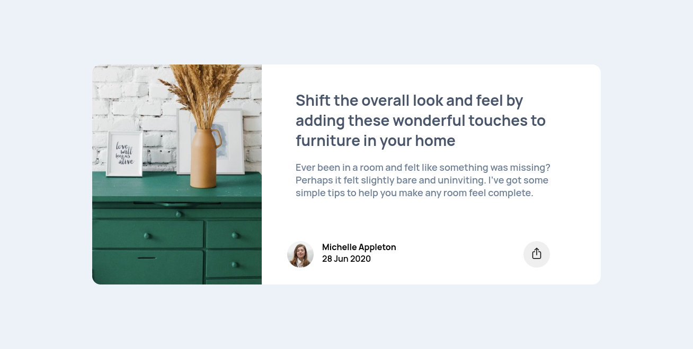
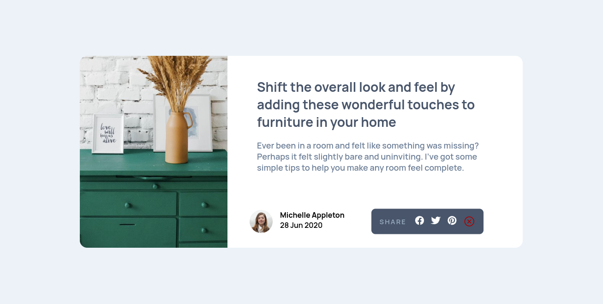
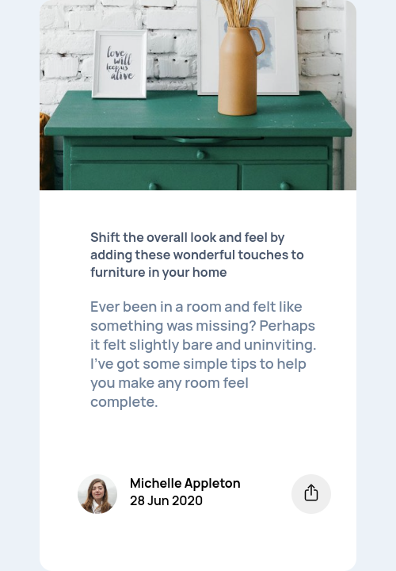
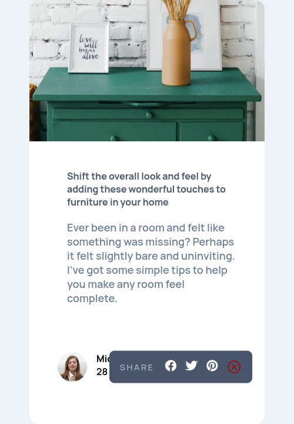

# Solution for Article Preview Card

This is a solution to the **Article Preview Card**.

- [Solution for Article Preview Card](#solution-for-article-preview-card)
  - [Preview](#preview)
    - [Desktop](#desktop)
    - [Desktop - `active`](#desktop---active)
    - [Mobile](#mobile)
    - [Mobile - `active`](#mobile---active)
  - [Tools](#tools)
  - [My JS code](#my-js-code)
    - [The code to toggle the popup](#the-code-to-toggle-the-popup)

## Preview

Below are the screenshots from both desktop and mobile screens.

### Desktop



### Desktop - `active`



### Mobile



### Mobile - `active`



## Tools

- Visual Studio Code
- HTML
- CSS `grid`
- CSS `flexbox`
- IonIcons

## My JS code

I'm still new to Javascript, and I still have a lot to learn.

### The code to toggle the popup

I used this to make the share button functional. This might not be great.

```js
shareBtn.addEventListener("click", () => {
  popup.classList.toggle("popup-show");
});
```
